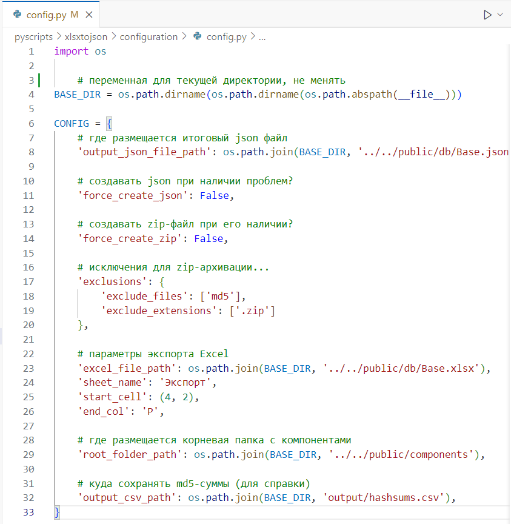

# Библиотека BIM-компонентов

Ссылка: https://nanoib.github.io/evoslib/.

Библиотека BIM-компонентов *evoslib* это удобное хранилище элементов, предназначенных для использования в программном комплексе **nanoCAD BIM Вентиляция**.

BIM-компонент — это zip-архив, содержащий структуру файлов и папок, загружаемых в программу. В библиотеке хранятся такие BIM-компоненты:
- моделирующие реальное оборудование
- элементы оформления (Текстовые выноски). 

Веб-интерфейс библиотеки:

</img>

# Содержание

1. [Зачем](#Зачем)
2. [Хранимые данные](#хранимые-данные)
3. [Доступ к библиотеке](#доступ-к-библиотеке)
4. [Используемые технологии](#используемые-технологии)
5. [Структура проекта](#структура-проекта)
   - [Файлы BIM-компонентов](#файлы-bim-компонентов)
   - [Файлы для подготовки и проверки целостности данных](#файлы-для-подготовки-и-проверки-целостности-данных)
   - [Описание python-скриптов](#описание-python-скриптов)
   - [Файлы веб-страницы библиотеки](#файлы-веб-страницы-библиотеки)
6. [Проблемы проекта](#проблемы-проекта)
7. [Как использовать](#как-использовать)

# Зачем

Эта библиотека создана в дополнение к официальной странице с базами оборудования  
https://www.nanocad.ru/products/bim/ventilation/database/,  
потому что эта официальная страница нефункциональная, неудобная и несовременная.

Библиотека *evoslib*:
- фильтрует BIM-компоненты не только по производителю и категории, но по типу графики, подкатегории, форме
- хранит и оборудование, и все, что требуется проектировщику
- отображает 3D-модель
- дает информацию о каждом компоненте отдельно, а не по группам компонентов
- предусматривает текстовое описание для компонентов
- показывает недавно добавленные компоненты в первую очередь
- ведет версионирование компонентов

# Хранимые данные

Подобно тому, как библиотека бумажных книг хранит не только книги, но и другую полезную информацию о них, такую как год издания, номер в каталоге и проч., библиотека BIM-компонентов хранит дополнительную информацию о BIM-компоненте:

| **Описание поля** | **Тип данных** | **Пример** | **Имя переменной в XLSX/JSON/JavaScript/Python** |  |
|---|---|---|---|---|
| Уникальный номер BIM-компонента | Целое число | 2 | id |  |
| Имя компонента (модель, серия, принятое название, краткое описание в случае оформительских элементов) | Текст | ДПУ-М | name |  |
| Категория, совпадающая с категорией на nanocad.ru | Текст из списка | Воздухораспределители | siteCategory |  |
| Подкатегория (техническое соответствие принятой практике, насколько возможно строгое) | Текст из списка | Решетка | technicalCategory |  |
| Дополнительная характеристика (техническое соответствие принятой практике как `technicalCategory`, но более мягкое, почти произвольное. Смотри тип данных) | Текст | жалюзийная | surname |  |
| Производитель | Текст | Арктос | manufacturer |  |
| Тип графики | Текст из списка | Параметрическая | graphicType |  |
| Форма подключаемого воздуховода или трубопровода | Текст из списка | Прямоугольный | shape |  |
| Доступные в BIM-компоненте типоразмеры | Текст в формате `красные: 100x100...300x300; белые: 100, 125, 630` (с `:` и `;`) или просто через запятую | 200x200, 300x300 | typesizes |  |
| Описание BIM-компонента | Текст | В параметрической dwg-графике реализована возможность поворота угла ламелей по параметру | note |  |
| Версия | Целое число | 2 | version |  |
| История изменений версий | Текст в формате `v1: бла-бла; v2: фу-бар` (c `v` и `;`) | v2: добавлены новые типоразмеры | versionHistory |  |
| Хэш-сумма BIM-компонента (технический идентификатор) | текст | ab025eae4c300876f39be86ae03c1d51 | md5 |  |
| Материал, из которого изготовлено оборудование (группа параметров) | булева переменная | {Алюминий: Да, Оцинкованная сталь: Нет, ...} | gal_steel, st_steel, aluminium, copper, ... |  |
| Дата последнего апдейта компонента | Текст в формате `2024.08.02`| 2029.12.31 | updDate |  |
| Ссылка на сайт производителя | Текст | http://.ru | manufUrl |  |

Типы данных приняты условно, а не технически. То есть в любое поле (при желании) может быть введено любое представимое в виде текста значение — но тогда правильная работа веб-интерфейса не гарантируется. Значения некоторых переменных контролируются при конвертации XLSX в JSON, подробнее ниже.

# Доступ к библиотеке

Библиотека компонентов доступна на GitHub Pages по адресу: [https://nanoib.github.io/evoslib/](https://nanoib.github.io/evoslib/).

GitHub Pages — это сервис, предоставляемый GitHub для хостинга статических веб-страниц прямо из репозиториев GitHub. Он доступен только для публичных репозиториев GitHub.

# Используемые технологии

Все используемые технологие открыты (open source), но имеют разные лицензии. Список лицензий не готов.

**Языки программирования и программные платформы**  
[*javascript*](https://ru.wikipedia.org/wiki/JavaScript) (+ javascript-библиотека [*jszip*](https://stuk.github.io/jszip/))  
[*python*](https://python.org/) (+ python-библиотеки [*PIL*](https://pillow.readthedocs.io/en/stable/index.html), [*pandas*](https://pandas.pydata.org/))     
[*node.js*](https://nodejs.org/en) (+ node.js-пакеты [*yarn*](https://yarnpkg.com/), [*vite*](https://vitejs.dev/))  
[*git*](https://git-scm.com/) (+ сервис [*GitHub Pages*](https://pages.github.com/))  
[*webassembly*](https://webassembly.org/)  (в зависимостях у *web-ifc*)

**Форматы данных**  
[*xlsx*](https://en.wikipedia.org/wiki/Office_Open_XML)  
[*ifc*](https://www.buildingsmart.org/standards/bsi-standards/industry-foundation-classes/) (+ node.js-пакет [*@thatopen/components*](https://github.com/ThatOpen/engine_components), и многие зависимые от него:  [*web-ifc*](https://www.npmjs.com/package/web-ifc), [*Three.js*](https://threejs.org/) и др.)  
[*png*](https://png-mng.sourceforge.net/pub/png/)  
[*json*](https://www.json.org/json-en.html)  
формат баз данных nanoCAD BIM Вентиляция ("[*repository*](https://download.nanodev.ru/distr/nanocadVent/23/instruction/nanoCAD%20BIM%20%D0%92%D0%B5%D0%BD%D1%82%D0%B8%D0%BB%D1%8F%D1%86%D0%B8%D1%8F.%20%D0%A0%D1%83%D0%BA%D0%BE%D0%B2%D0%BE%D0%B4%D1%81%D1%82%D0%B2%D0%BE%20%D0%BF%D0%BE%D0%BB%D1%8C%D0%B7%D0%BE%D0%B2%D0%B0%D1%82%D0%B5%D0%BB%D1%8F.pdf/)")

**Языки разметки**  
[*html*](https://en.wikipedia.org/wiki/HTML)  
[*css*](https://www.w3.org/Style/CSS/)  
[*markdown*](https://daringfireball.net/projects/markdown/)  

# Структура проекта

Проект организован в несколько основных директорий и файлов.

## Файлы BIM-компонентов

Все файлы непосредственно BIM-компонентов хранятся в папке *public/components*. Внутри *components* структура папок устроена с использованием переменных, описывающих компоненты (которые перечислены в таблице выше). Структура:

/public/components/ `{siteCategory}` / `{technicalCategory}` / id`{id}`\_v`{version}`\_`{name}` / `{name}`,

где самая нижняя (глубокая) папка, `{name}`, — непосредственно директория BIM-компонента, т.е. директория, содержащая файл *\*.repository*, папки *Dwg* и другие, определяемые логикой  программного комплекса **nanoCAD BIM Вентиляция**.

Пример дерева директорий для компонента Шумоглушитель с id=25 и Именем компонента="ГТК":

</img>

Эта структура выбрана как компромисс между машино- и человекочитаемой структурой: она одинаково удобна как для разработки BIM-библиотеки, так и для непосредственно проектирования. Здесь подразумевается, что пользователь может скачать всю папку *components* на локальный компьютер из *GitHub* или из веб-интерфейса.

Устаревшие версии компонентов хранятся в папке *_old* внутри папки *{technicalCategory}*. Папки с именем *_old* игнорируются при проверке целостности базы данных.

Поскольку BIM-компоненты скачиваются в виде архива, эти архивы должны быть подготовлены заранее (создание zip-архивов компонентов по кнопке реализуемо с помощью серверных технологий типа *php* или *node.js*, но GitHub Pages их не поддерживает). Эти заранее подготовленные архивы размещаются в папке *id`{id}`\_v`{version}`\_`{name}`* и имеют такое же имя, как эта папка, но с расширением *\*.zip*. Здесь `{name}`=ГТК:

</img>

Как видно на скриншоте выше, папка *id`{id}`\_v`{version}`\_`{name}`* кроме zip-архива содержит также:
- файл *md5*. Это текстовый файл с хеш-суммой файлов в соседней папке *`{name}`* , аналогичной хеш-сумме в XLSX/JSON файле
- файл *`{id}`.ifc*. Это 3D-модель компонента, получаемая кнопкой *Экспорт в IFC* в программе
- файл *`{id}`.png*. Это изображение компонента, скриншот 3D-модели. Это изображение должно быть обрезано с помощью скрипта *cropwhite.py*, подробнее ниже.

Эта папка может содержать другие файлы. Например, файлы, которые производители компонентов поставляют вместе с компонентом как вспомогательную информацию. Этот и любые другие файлы, с именами, не совпадающими с *md5* и *.zip* будут включены в архив при автоматической архивации.

## Файлы для подготовки и проверки целостности данных

- **public/db**  
Папка `db` содержит файлы данных: `Base.json`, `Base.xlsx`. Эти файлы являются источниками данных для проекта. 

    В `Base.xlsx` администратор библиотеки вносит данные, получаемые от производителей оборудования: названия BIM-компонентов, их категорию, типоразмеры и другие параметры из таблицы выше, а также хеш-сумму, расчитанную с помощью `hashcalc.py`: непосредственно или посредством `xlsxtojson.py`.
    Из `Base.json` происходит чтение данных при отрисовке веб-страницы. 
    Превращение `Base.xlsx` в `Base.json` проводит скрипт `xlsxtojson`, помимо этой простой операции проводящий также проверки библиотеки на целостность и архивацию BIM-компонентов в *\*.zip*

- **pyscripts**  
Папка `pyscripts` содержит  Python-скрипты, помогающие администрировать базу данных. Каждый скрипт со вспомогательными файлами находится в своей папке: `cropwhite`, `rename`, `folders` и `xlsxtojson`. `xlsxtojson` также использует вспомогательные скрипты из папки `pyscripts/xlsxtojson/utils`: они подробно описаны в отдельном Readme: **[Скрипт xlsxtojson](/git/xlsxtojsonreadme/xlsxtojsonreadme.md)**.

    При необходимости разобраться с python-скриптами помогут комментарии в коде:

    </img>

    Все настройки директорий и другие хранятся в отдельном файле:

    </img>

## Описание python-скриптов

- **pyscripts/xlsxtojson**  
    Это единственный скрипт, использование которого необходимо при добавлении или удалении BIM-компонентов библиотеки (впрочем, даже без него даные в `Base.json` можно внести или удалить, используя Блокнот).

    Скрипт `xlsxtojson.py` преобразует данные из Excel файла (`Base.xlsx`) в формат JSON (`Base.json`). Это необходимо для того, чтобы данные о компонентах могли быть легко использованы JavaScript. Также этот скрипт выполняет множественные проверки BIM-библиотеки, создание *md5* и *zip*-файлов. 

        Зачем нужны md5 файлы?

        Хеш-сумма md5 — цифровой отпечаток файла, его идентификатор длиной в 32 символа. Например, хеш-сумма для пустого файла в 0 байт всегда такая: "d41d8cd98f00b204e9800998ecf8427e". Изменение даже 1 байта в даже многотерабайтном файле приведет к изменению всей хеш-суммы. В BIM-библиотеке хеш-сумма считается не для одного, а для нескольких файлов — всех файлов в папке BIM-компонента. Это необходимо для того, чтобы убедиться, что с течением времени файлы в папке BIM-компонента не изменились. Это особенно важно в случае nanoCAD BIM-вентиляция, т.к. этот программный комплекс имеет свойство необратимо изменять файл BIM-компонент при открытии, даже без внесения в него изменений. Таким образом, без проверки хеш-суммы или другого однозначного идентификатора файла назначение ему версии теряет смысл.

    Полный список функций скрипта:

    - Проверка равенства md5-сумм: фактической, в *json* и в *md5*-файлах  (с помощью `md5_checker.py`)
    - Создание файла *md5* при его отсутствии (с помощью `hashcalc.py`)
    - Создание *zip*-файлов при их отсутствии  (с помощью `zipper.py`). Перезапись *zip*-файлов при соответствующей настройке в `config.py`
    - Проверка на наличие лишних файлов и папок (с помощью `consistency_checker.py`)
    - Проверка на наличие изображений для каждого компонента в папке `im`
    - Наличие всех необходимых папок с компонентами (сейчас это избыточная проверка)

    Подробнее о работе `xlsxtojson.py` см. в отдельном README: **[Скрипт xlsxtojson](/git/xlsxtojsonreadme/xlsxtojsonreadme.md)**

    Пример отчета об успешной работе `xlsxtojson.py`:

    </img>

    Все скрипты можно запускать двойным кликом левой кнопке мыши из Проводника Windows.

- **pyscripts/cropwhite**  
Скрипт `cropwhite.py` предназначен для обработки изображений компонентов. Он выполняет обрезку скриншотов, удаляя лишние белые поля вокруг компонентов, и добавляет белую границу заданного размера для достижения нужного соотношения сторон изображений. Это помогает стандартизировать внешний вид изображений компонентов в библиотеке.

- **pyscripts/rename**  
Скрипт `rename.py` используется для массового переименования файлов (может быть необходимо для массового именования скриншотов). Скрипт принимает на вход исходные имена из *from.txt* и целевые имена из *to.txt*. Папка с компонентами задается в тексте скрипта. 

- **pyscripts/folders**  
Скрипт `folders` создает все недостающие папки для BIM-компонентов, что полезно при добавлении большого количества новых компонентов.

- **pyscripts/requirements.txt**
Этот файл необходим, чтобы быстро установить все необходимые зависимости при запуске на новом компьютере. 

## Файлы разработки веб-страницы библиотеки

Ниже перечислены файлы, используемые при разработке и содержащие исходный код. В прод отправляются не эти файлы, а так называемые bundles - файлы, собранные бандлером - специальной программой, в данном случае *Vite*. Бандлер позволяет убрать неиспользуемый код зависимостей, облегчить итоговые файл, загружаемые браузером пользователя. Bundles для прода хранятся в папке **/docs/**. Настройки бандлера хранятся в `vite.config.js`.

- **index.html**  
Размещает основные элементы веб-страницы: заголовок, шапка, боковая секция фильтра, сетка BIM-компонентов. Хранит теги для поисковика. Загружает файлы JavaScript.

- **jsscripts**  
Папка с JavaScript-скриптами. Они улучшают веб-интерфейс и предоставляют дополнительную функциональность.

- **jsscripts/main.js**  
Этот модуль отвечает за инициализацию веб-приложения. Он загружает данные BIM-компонентов из файла `Base.json`. После загрузки данных он инициализирует фильтры и отображает BIM-компоненты. Устанавливает ожидания для действий - сортировка, фильтрация, кнопка скачивания, клик по плитке.

- **jsscripts/components.js**  
Этот модуль обрабатывает отображение BIM-компонентов на веб-странице. Он создает необходимые HTML-элементы (плитки) для каждого BIM-компонента и добавляет их в сетку компонентов. Также он устанавливает обработчики событий для открытия модального окна при клике на BIM-компонент.

    Текст в плитке имеет дополнительное правило отображения:
    - если *Дополнительная характеристика* (`component.surname`) для BIM-компонента не определена, то она не отображается; отделяющий это поле пробел в этом случае тоже не отображается 

Также этот модуль добавляет функционал архивирования отрисованных в данный момент на странице компонентов по кнопке "Скачать". И сортировку. 

- **jsscripts/filters.js**  
Этот модуль управляет функциональностью фильтров. Он инициализирует фильтры на основе данных BIM-компонентов, и отображает их по разделам фильтрации, прописанным в коде: "Техническая категория", "Производитель", "Тип графики" и "Форма". Также он применяет фильтры к данным BIM-компонентов и обновляет отображаемые компоненты соответственно. Кроме того, он предоставляет функцию сброса для очистки всех фильтров.

    - Фильтры внутри каждой из категорий работают по принципу ИЛИ (т.е. выбрав двух производителей, вы увидите BIM-компоненты каждого из двух производителей), а фильтры различных категорий работают по принципу И (т.е. добавив к тем фильтрам по производителям еще и фильтры из других категорий, например "Тип графики" = *Параметрическая графика* и "Форма" = *Круглый*, вы увидите только круглые и параметрические BIM-компоненты именно этих производителей).

    - Как было упомянуто, разделы фильтрации прописаны в коде. Однако сами категории фильтрации (прописанные рядом с чекбоксами) создаются динамически на основании данных в базе. Эти категории и подкатегории динамически (то есть прямо при открытии страницы, во время работы скрипта) создаются скриптом `filters.js` на основании данных из `Base.json`. 

    Таким образом, например, для создания новой категории оборудования *Изоляция воздуховодов* с подкатегориями *Трубчатая изоляция* и *Листовая изоляция*, администратору базы данных достаточно добавить в файл `Base.xlsx` две новых строчки с данными новых компонентов: столбец `siteCategory` у обоих должен быть заполнен *Изоляция воздуховодов*, а столбец `technicalCategory` заполнен *Трубчатая изоляция* для первого и *Листовая изоляция* для второго компонента. Далее разместить в папке **im** изображения для компонентов, а в поле *md5* ввести хеш-сумму, расчитанную запуском скрипта **hashcalc.py** двойным кликом. Далее запустить скрипт **xlsxtojson.py** - и все!

- **jsscripts/modal.js**  
Этот модуль управляет функциональностью модального окна, появляющегося при клике на плитку BIM-компонента. Он определяет функцию *openModal*, которая заполняет модальное окно деталями выбранного BIM-компонента и отображает его.

    - Текст в модальном окне имеет дополнительные правила отображения:
        - если *Типоразмеры* содержат точку с запятой `;`, текст после нее переносится на новую строку
        - если *Форма* или *Типоразмеры* имеют в xlsx/json значение *Не применимо*, то эти поля не отображаются
        - если *История версий* содержит `v` с последующей цифрой, то этот текст выделяется жирным, а после `;` переносится строка

    Текст в модальном окне отображает все непустые параметры с учетом выше описанных правил:

</img>

- **jsscripts/ifcloader.js**  
Этот модуль определяет логику загрузки ifc-файла и отображения 3D-модели. Он использует библиотеку *@thatopen/fragments*, которая, в свою очередь, использует другие, например *web-ifc* и *Three.js*. 

Эти библиотеки имеют готовые инструменты для продвинутых инструментов, таких, как измерения длин и углов, фильтрация примитивов, работа с IFC-свойствами и другие.

- **.nojekyll**  
Файл `.nojekyll` используется для отключения обработки Jekyll на GitHub Pages, что позволяет использовать произвольные файлы и директории. Не ясно, почему это необходимо, но без этого файла скрипт не мог прочитать файл `Base.json`. 

## Стили

- **styles/light/*.css**  
Здесь размещены файлы с CSS-стилями, применяемые к веб-интерфейсу библиотеки. Обеспечивают визуально привлекательный вид и иногда обеспечивают функционал (например, скрытие модального окна по клику вне этого окна). Разделены по смысловым категориям проекта. 

- **styles/img/*.png**
Здесь размещены изображения, используемые в веб-интерфейсе:
`favicon.png` - изображение для вкладки браузера  
`icon.png` - изображение, показываемое в окне по нажатию на кнопку "i" в шапке веб-интерфейса.

# Проблемы проекта
Проект имеет недостатки, которые могут повлиять на его эффективность и удобство использования:

- **Проблемы при большом количестве компонентов**: При многократном увеличении количества компонентов в библиотеке, производительность скриптов может значительно снизиться, браузер будет тормозить, а страницей будет неудобно пользоваться. Это может привести к замедлению работы веб-интерфейса и ухудшению пользовательского опыта.
- **Необходимость установки python и библиотек к нему для работы `xlsxtojson.py`**: Хотя Python - Open Source, необходимость установки дополнительных python-модулей (pandas, pillow, tqdm, hashlib) может стать проблемой. #todo файлы requirements

Эти проблемы можно обойти различными способами.

## Зависимости
- **/nodemodules/**  
В этой папке хранятся все зависимости проекта.  Все зависимости проекта связаны с применением библиотеки *@thatopen/fragments*, дающей возможность просматривать IFC-модели в браузере.  
Зависимости разрешаются с помощью пакетного менеджера *Yarn*. Файлы, относящиеся к пакетному менеджеру:

    `/.yarn/` - директория с исполняемыми файлами *Yarn*  
    `yarn.lock` - фиксированный список установленных зависимостей, дающий возможность составить однозначно такую же сборку на другой машине  
    `.yarnrc.yml` - настройки *Yarn*. Важные  

# Как использовать

## Кто может настроить свою библиотеку BIM-компонентов evoslib
Каждый может скопировать этот Git-репозиторий и через несколько минут наладить собственную BIM-библиотеку на GitHub Pages. Ее можно использовать как отдельную библиотеку BIM-компонентов проектного бюро или как библиотеку производителя оборудования, ка личную библиотеку проектировщика, в т.ч. для хранения компонентов для других программных комплексов и т.д.  
Однако для этого потребуются специализированные знания в области веб-разработки.

## Использование как бизнес-процесс
Для размещения этой библиотеки в it-инфраструктуре предприятия потребуется учесть особенности этой инфраструктуры. Однажды развернув ее, дальнейший процесс по добавлению BIM-компонентов становится доступен неспециалистам. Пошаговые инструкции для добавления/удаления BIM-компонентов даны выше по ссылке на README-файл для скрипта *xlsxtojson.py*.