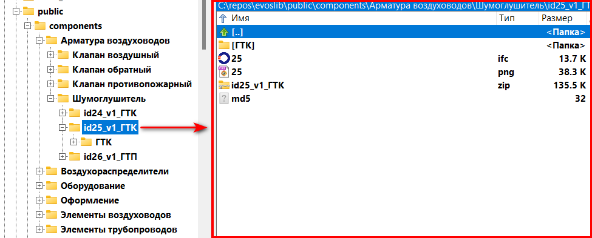

# Библиотека BIM-компонентов

Ссылка: https://nanoib.github.io/evoslib/.

Библиотека BIM-компонентов *evoslib* это удобное хранилище элементов, предназначенных для использования в программном комплексе **nanoCAD BIM Вентиляция**.

BIM-компонент — это zip-архив, содержащий структуру файлов и папок, загружаемых в программу. В библиотеке представлены такие BIM-компоненты:
- моделирующие реальное оборудование
- являющиеся элементом оформления (Текстовые выноски). 

Веб-интерфейс библиотеки:

</img>

# Содержание

1. [Нахера](#Нахера)
2. [Хранимые данные](#хранимые-данные)
3. [Доступ к библиотеке](#доступ-к-библиотеке)
4. [Структура проекта](#структура-проекта)
   - [Файлы BIM-компонентов](#файлы-bim-компонентов)
   - [Файлы для подготовки и проверки целостности данных](#файлы-для-подготовки-и-проверки-целостности-данных)
   - [Описание python-скриптов](#описание-python-скриптов)
   - [Файлы веб-страницы библиотеки](#файлы-веб-страницы-библиотеки)
5. [Проблемы проекта](#проблемы-проекта)
6. [Дорожная карта](#дорожная-карта)

# Нахера

Эта библиотека создана в дополнение к официальной странице с базами оборудования  
https://www.nanocad.ru/products/bim/ventilation/database/,  
потому что эта официальная страница нефункциональная, неудобная и несовременная. Добавление в нее даже одного компонента требует подключения минимум трех специалистов.

Библиотека *evoslib*:
- фильтрует BIM-компоненты не только по производителю и категории, а еще по подкатегории, по типу графики, по форме
- показывает, как выглядит 3D-модель
- дает информацию о каждом компоненте отдельно, а не по группам компонентов
- ведет версионирование BIM-компонентов с описанием изменений.

# Хранимые данные

Подобно тому, как библиотека бумажных книг хранит не только книги, но и другую полезную информацию о них, такую как год издания, номер в каталоге и проч., библиотека BIM-компонентов хранит дополнительную информацию о BIM-компоненте:

| Описание поля                                                  | Тип данных                                                                                  | Пример                                                                                   | Имя переменной в XLSX/JSON/JavaScript/Python    |
|--------------------------------------------------------------------|---------------------------------------------------------------------------------------------|------------------------------------------------------------------------------------------|---------------------------------------------|
| Уникальный номер BIM-компонента                                    | Целое число                                                                                 | 2                                                                                        | id                                          |
| Имя компонента (модель, серия, принятое название, краткое описание в случае оформительских элементов) | Текст                                                                                       | ДПУ-М                                                                                    | name                                        |
| Категория, совпадающая с категорией на nanocad.ru                  | Текст из списка                                                                             | Воздухораспределители                                                                    | siteCategory                                |
| Подкатегория (техническое соответствие принятой практике, насколько возможно строгое)                                                       | Текст из списка                                                                             | Решетка                                                                                  | technicalCategory                           |
| Дополнительная характеристика (техническое соответствие принятой практике как `technicalCategory`, но более мягкое, почти произвольное. Смотри тип данных)                                      | Текст                                                                              | жалюзийная                                                                               | surname                                     |
| Производитель                                                      | Текст                                                                                       | Арктос                                                                                   | manufacturer                                |
| Тип графики                                                        | Текст из списка                                                                             | Параметрическая                                                                          | graphicType                                 |
| Форма подключаемого воздуховода или трубопровода                   | Текст из списка                                                                             | Прямоугольный                                                                            | shape                                       |
| Доступные в BIM-компоненте типоразмеры                             | Текст в формате `красные: 100x100...300x300; белые: 100, 125, 630` (с `:` и `;`) или просто через запятую | 200x200, 300x300                                                                         | typesizes                                   |
| Описание BIM-компонента                                            | Текст                                                                                       | В параметрической dwg-графике реализована возможность поворота угла ламелей по параметру | note                                        |
| Версия                                                             | Целое число                                                                                 | 2                                                                                        | version                                     |
| История изменений версий                                           | Текст в формате `v1: бла-бла; v2: фу-бар` (c `v` и `;`)                                                   | v2: добавлены новые типоразмеры                                                          | versionHistory                              |
| Хэш-сумма BIM-компонента (технический идентификатор)               | текст                                                                                       | ab025eae4c300876f39be86ae03c1d51                                                         | md5                                         |
| Материал, из которого изготовлено оборудование (группа параметров) | булева переменная                                                                           | {Алюминий: Да, Оцинкованная сталь: Нет, ...}                                             | gal_steel, st_steel, aluminium, copper, ... |
| Ссылка на сайт производителя                                       | Текст                                                                                       | http://.ru                                                                             | manufUrl                                    |

Типы данных приняты условно, не технически. То есть, в принципе, в каждое поле может быть введено любое представимое в виде текста значение — но тогда правильная работа веб-интерфейса не гарантируется. Типы данных контролируются только на этапе ввода информации в xlsx средствами Excel. Значения этих данных контролируются при превращении XLSX в файл формата JSON, подробнее ниже.

# Доступ к библиотеке

Библиотека компонентов доступна на GitHub Pages по адресу: [https://nanoib.github.io/evoslib/](https://nanoib.github.io/evoslib/).

GitHub Pages — это сервис, предоставляемый GitHub для хостинга статических веб-страниц прямо из репозиториев GitHub. Он доступен только для публичных репозиториев GitHub.

# Структура проекта

Проект организован в несколько основных директорий и файлов.

## Файлы BIM-компонентов

Все файлы непосредственно BIM-компонентов хранятся в папке *components*. Внутри *components* структура папок устроена с использованием переменных, описывающих компоненты (которые перечислены в таблице выше). Структура:

/components/ `{siteCategory}` / `{technicalCategory}` / id`{id}`\_v`{version}`\_`{name}` / `{name}`,

где последняя папка, `{name}`, — непосредственно директория BIM-компонента, т.е. папка, содержащая файл *\*.repository*, папки *Dwg* и другие, определяемые логикой  программного комплекса **nanoCAD BIM Вентиляция**.

Пример дерева директорий в *components*:

</img>

Эта структура выбрана как компромисс между машино- и человекочитаемой структурой: она одинаково удобна как для разработки BIM-библиотеки, так и для непосредственно проектирования. Здесь имеется ввиду,что непосредственно для проектирования можно скачать всю папку *components* на локальный компьютер, нажав зеленую кнопку *< Code >* -> *Download ZIP* вверху этой страницы *GitHub*.

Устаревшие версии компонентов должны храниться в папке *_old* внутри папки *{technicalCategory}*. Папки с именем *_old* игнорируются при проверке целостности базы данных.

Поскольку BIM-компоненты скачиваются в виде архива, эти архивы должны быть подготовлены заранее (on-demand реализуем, но GitHub Pages поддерживает только статические страницы, без серверных технологий типа *php* или *node.js*). Архивы размещаются в папке *id`{id}`\_v`{version}`\_`{name}`* и имеют такое же имя, как эта папка, но с расширением *\*.zip*:

</img>

Как видно на скриншоте выше, папка *id`{id}`\_v`{version}`\_`{name}`* кроме zip-архива содержит также:
- файл *md5*. Это текстовый файл с хеш-суммой файлов в папке *`{name}`* , аналогичной хеш-сумме в xlsx/json файле.
- файл *\*.doc*. Этот файл (в конкретном случае) был поставлен производителем вместе с компонентом как вспомогательная информация. Этот и любые другие файлы, с именами, не совпадающими с *md5* и *.zip* будут включены в архив при автоматической архивации.

Файл *.gitignore* устанавливает правила для синхронизации файлов с GitHub. Здесь важно, что внутри папки *components* разрешена синхронизация только файлов *\*.zip* (причем только в глубине каталога 4, */components/\*/\*/\*/\*.zip*, чтобы *zip* из *_old* не попадали в GitHub) и *md5*. То есть, "распакованные" репозитории не появляются в GitHub. Это сделано по соображениям производительности.

## Файлы для подготовки и проверки целостности данных

- **db**  
Папка `db` содержит файлы данных: `Base.json`, `Base.xlsx`. Эти файлы являются источниками данных для проекта. 

    В `Base.xlsx` администратор библиотеки вносит данные, получаемые от производителей оборудования: названия BIM-компонентов, их категорию, типоразмеры и другие параметры из таблицы выше, а также хеш-сумму, расчитанную с помощью `hashcalc.py`: непосредственно или посредством `xlsxtojson.py`.
    Из `Base.json` происходит чтение данных при отрисовке веб-страницы. 
    Превращение `Base.xlsx` в `Base.json` проводит скрипт `xlsxtojson`, помимо этой простой операции проводящий также проверки библиотеки на целостность и архивацию BIM-компонентов в *\*.zip*

- **im**  
Папка `im` содержит изображения BIM-компонентов. Это скриншоты из программы.

    Имена компонентов должны составляться по формуле: *`{id}`.png*.

- **pyscripts**  
Папка `pyscripts` содержит  Python-скрипты, помогающие администрировать базу данных. Каждый скрипт со вспомогательными файлами находится в своей папке: `cropwhite`, `rename`, `folders` и `xlsxtojson`. `xlsxtojson` также использует вспомогательные скрипты из папки `pyscripts/xlsxtojson/utils`: они подробно описаны в отдельном Readme: **[Скрипт xlsxtojson](/git/xlsxtojsonreadme/xlsxtojsonreadme.md)**.

    При необходимости разобраться с python-скриптами помогут комментарии в коде:

    </img>

## Описание python-скриптов

- **pyscripts/xlsxtojson**  
    Это единственный скрипт, использование которого необходимо при добавлении или удалении BIM-компонентов библиотеки (впрочем, даже без него даные в `Base.json` можно внести или удалить, используя Блокнот).

    Скрипт `xlsxtojson.py` преобразует данные из Excel файла (`Base.xlsx`) в формат JSON (`Base.json`). Это необходимо для того, чтобы данные о компонентах могли быть легко использованы JavaScript. Также этот скрипт выполняет множественные проверки BIM-библиотеки, создание *md5* и *zip*-файлов. 

        Зачем нужны *md5* файлы?

        Хеш-сумма *md5* — цифровой отпечаток файла, его идентификатор длиной в 32 символа. Например, хеш-сумма для пустого файла в 0 байт всегда такая: "d41d8cd98f00b204e9800998ecf8427e". Изменение даже 1 байта в даже многотерабайтном файле приведет к изменению всей хеш-суммы. В BIM-библиотеке хеш-сумма считается не для одного, а для нескольких файлов — всех файлов в папке BIM-компонента. Это необходимо для того, чтобы убедиться, что с течением времени файлы в папке BIM-компонента не изменились. Это особенно важно в случае nanoCAD BIM-вентиляция, т.к. этот программный комплекс имеет свойство необратимо изменять файл BIM-компонент при открытии, даже без внесения в него изменений. Таким образом, без проверки хеш-суммы или другого однозначного идентификатора файла назначение ему версии теряет смысл.

    Полный список функций скрипта:

    - Проверка равенства md5-сумм: фактической, в *json* и в *md5*-файлах  (с помощью `md5_checker.py`)
    - Создание файла *md5* при его отсутствии (с помощью `hashcalc.py`)
    - Создание *zip*-файлов при их отсутствии  (с помощью `zipper.py`). Перезапись *zip*-файлов при соответствующей настройке в `config.py`
    - Проверка на наличие лишних файлов и папок (с помощью `consistency_checker.py`)
    - Проверка на наличие изображений для каждого компонента в папке `im`
    - Наличие всех необходимых папок с компонентами (сейчас это избыточная проверка)

    Подробнее о работе `xlsxtojson.py` см. в отдельном README: **[Скрипт xlsxtojson](/git/xlsxtojsonreadme/xlsxtojsonreadme.md)**

    Пример отчета об успешной работе `xlsxtojson.py`:

    </img>

    Все скрипты можно запускать двойным кликом левой кнопке мыши из Проводника Windows.

- **pyscripts/cropwhite**  
Скрипт `cropwhite.py` предназначен для обработки изображений компонентов. Он выполняет обрезку скриншотов, удаляя лишние белые поля вокруг компонентов, и добавляет белую границу заданного размера для достижения нужного соотношения сторон изображений. Это помогает стандартизировать внешний вид изображений компонентов в библиотеке.

- **pyscripts/rename**  
Скрипт `rename.py` используется для массового переименования файлов (может быть необходимо для массового именования скриншотов). Скрипт принимает на вход исходные имена из *from.txt* и целевые имена из *to.txt*. Папка с компонентами задается в тексте скрипта. 

- **pyscripts/folders**  
Скрипт `folders` создает все недостающие папки для BIM-компонентов, что полезно при добавлении большого количества новых компонентов.

## Файлы веб-страницы библиотеки

- **index.html**  
Размещает основные элементы веб-страницы: заголовок, шапка, боковая секция фильтра, сетка BIM-компонентов. Хранит теги для поисковика. Загружает файлы JavaScript.

- **jsscripts**  
Папка с JavaScript-скриптами. Они улучшают веб-интерфейс и предоставляют дополнительную функциональность.

- **jsscripts/main.js**  
Этот модуль отвечает за инициализацию веб-приложения. Он загружает данные BIM-компонентов из файла `Base.json`. После загрузки данных он инициализирует фильтры и отображает BIM-компоненты.

- **jsscripts/components.js**  
Этот модуль обрабатывает отображение BIM-компонентов на веб-странице. Он создает необходимые HTML-элементы (плитки) для каждого BIM-компонента и добавляет их в сетку компонентов. Также он устанавливает обработчики событий для открытия модального окна при клике на BIM-компонент.

    Текст в плитке имеет дополнительное правило отображения:
    - если *Дополнительная характеристика* (`component.surname`) для BIM-компонента не определена, то она не отображается; отделяющий это поле пробел в этом случае тоже не отображается 

- **jsscripts/filters.js**  
Этот модуль управляет функциональностью фильтров. Он инициализирует фильтры на основе данных BIM-компонентов, и отображает их по разделам фильтрации, прописанным в коде: "Техническая категория", "Производитель", "Тип графики" и "Форма". Также он применяет фильтры к данным BIM-компонентов и обновляет отображаемые компоненты соответственно. Кроме того, он предоставляет функцию сброса для очистки всех фильтров.

    - Фильтры внутри каждой из категорий работают по принципу ИЛИ (т.е. выбрав двух производителей, вы увидите BIM-компоненты каждого из двух производителей), а фильтры различных категорий работают по принципу И (т.е. добавив к тем фильтрам по производителям еще и фильтры из других категорий, например "Тип графики" = *Параметрическая графика* и "Форма" = *Круглый*, вы увидите только круглые и параметрические BIM-компоненты именно этих производителей).

    - Как было упомянуто, разделы фильтрации прописаны в коде. Однако сами категории фильтрации (прописанные рядом с чекбоксами) создаются динамически на основании данных в базе. Эти категории и подкатегории динамически (то есть прямо при открытии страницы, во время работы скрипта) создаются скриптом `filters.js` на основании данных из `Base.json`. 

    Таким образом, например, для создания новой категории оборудования *Изоляция воздуховодов* с подкатегориями *Трубчатая изоляция* и *Листовая изоляция*, администратору базы данных достаточно добавить в файл `Base.xlsx` две новых строчки с данными новых компонентов: столбец `siteCategory` у обоих должен быть заполнен *Изоляция воздуховодов*, а столбец `technicalCategory` заполнен *Трубчатая изоляция* для первого и *Листовая изоляция* для второго компонента. Далее разместить в папке **im** изображения для компонентов, а в поле *md5* ввести хеш-сумму, расчитанную запуском скрипта **hashcalc.py** двойным кликом. Далее запустить скрипт **xlsxtojson.py** - и все!

- **jsscripts/modal.js**  
Этот модуль управляет функциональностью модального окна, появляющегося при клике на плитку BIM-компонента. Он определяет функцию *openModal*, которая заполняет модальное окно деталями выбранного BIM-компонента и отображает его.

    - Текст в модальном окне имеет дополнительные правила отображения:
        - если *Типоразмеры* содержат точку с запятой `;`, текст после нее переносится на новую строку
        - если *Форма* или *Типоразмеры* имеют в xlsx/json значение *Не применимо*, то эти поля не отображаются
        - если *История версий* содержит `v` с последующей цифрой, то этот текст выделяется жирным, а после `;` переносится строка

    Текст в модальном окне отображает все непустые параметры с учетом выше описанных правил:

</img>

- **.nojekyll**  
Файл `.nojekyll` используется для отключения обработки Jekyll на GitHub Pages, что позволяет использовать произвольные файлы и директории. Не ясно, почему это необходимо, но без этого файла скрипт не мог прочитать файл `Base.json`. 

- **styles.css**  
CSS-стили, применяемые к веб-интерфейсу библиотеки. Обеспечивают визуально привлекательный вид.

# Проблемы проекта
Проект имеет недостатки, которые могут повлиять на его эффективность и удобство использования:

- **Проблемы при большом количестве компонентов**: При многократном увеличении количества компонентов в библиотеке, производительность скриптов может значительно снизиться, браузер будет тормозить, а страницей будет неудобно пользоваться. Это может привести к замедлению работы веб-интерфейса и ухудшению пользовательского опыта.
- **Необходимость установки python и библиотек к нему для работы `xlsxtojson.py`**: Хотя Python - Open Source, необходимость установки дополнительных python-модулей (pandas, pillow, tqdm, hashlib) может стать проблемой. #todo файлы requirements

Эти проблемы можно обойти различными способами.

# Дорожная карта

Проект не имеет дорожной карты.