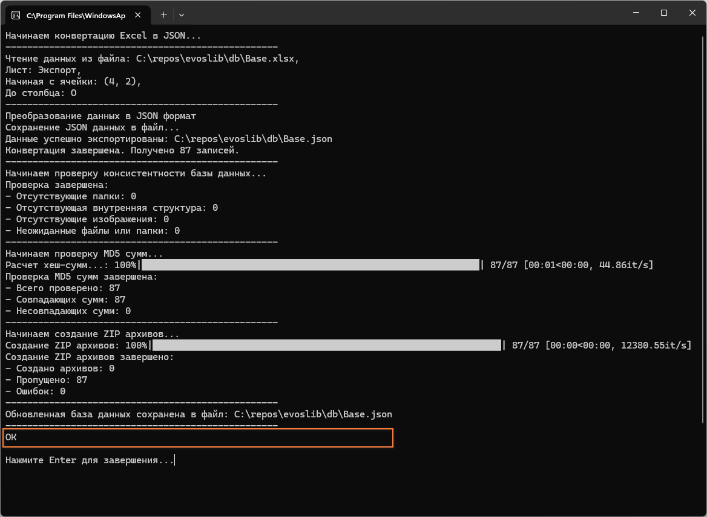
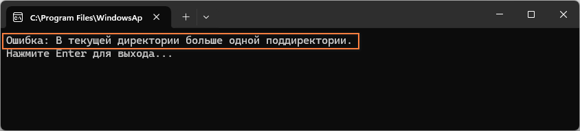
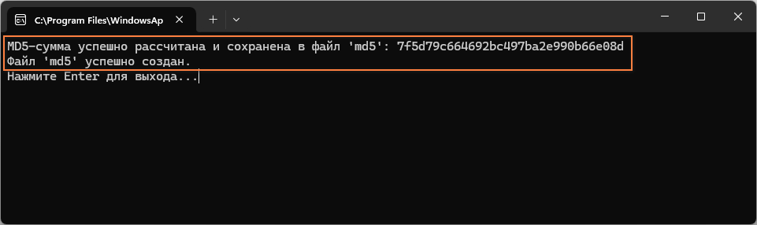
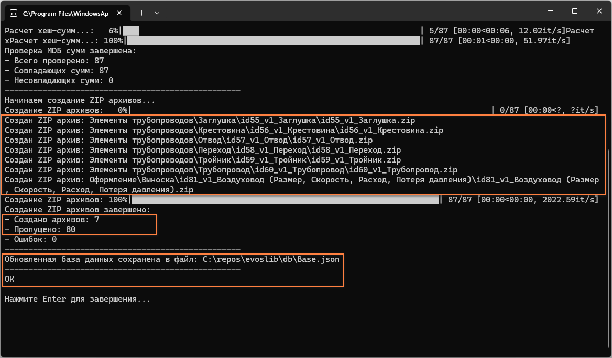

# Содержание
1. [Описание скриптов](#описание-скриптов)
   - [xlsxtojson.py](#xlsxtojsonpy)
   - [utils/consistency_checker.py](#utilsconsistency_checkerpy)
   - [utils/md5_checker.py](#utilsmd5_checkerpy)
   - [utils/hashcalc.py](#utilshashcalcpy)
   - [utils/zipper.py](#utilszipperpy)
2. [Примеры работы скриптов](#примеры-работы-скриптов)

# Описание скриптов

Этот readme предназначен для того, чтобы описать логику и назначение скрипта **xlsxtojson.py** с подскриптами.

## **xlsxtojson.py**  
Скрипт предназначен для превращения человекочитаемого *xlsx*-формата в машиночитаемый *json*-файл. Он работает по следующим шагам:
1. Чтение данных из Excel файла, начиная с указанной ячейки и до указанного столбца.
2. Преобразование данных в формат JSON.
3. Запуск "проверок" с помощью файлов, перечисленных ниже.
3. Сохранение JSON данных в указанный файл при прохождении всех проверок (#todo сейчас сохранение выполняется до выполнения проверок).

## **utils/consistency_checker.py**  
Этот скрипт проверяет консистентность (цельность, интегрированность) базы данных компонентов. Он выполняет следующие проверки:
1. Наличие всех необходимых папок в структуре */components/*.
2. Наличие всех необходимых изображений.
3. Отсутствие неожиданных файлов или папок.

Пример отчета, когда не найдена нужная папка:

Пример отчета, когда найдена **не**нужная папка:

## **utils/md5_checker.py**  
Этот скрипт проверяет MD5 суммы файлов компонентов. Он выполняет следующие шаги:
1. Чтение MD5 суммы из JSON данных.
2. Вычисление MD5 суммы для каждого файла внутри папки с BIM-компонентом.
3. Сравнение вычисленной MD5 суммы с указанной в JSON и файле MD5.
4. Создание MD5 файла, если он отсутствует, по запросу пользователя.

Пример отчета, когда найдены отличия в *md5*-суммах:

Пример отчета, когда не найден *md5*-файл:

## **utils/hashcalc.py**  
Этот скрипт вычисляет MD5 суммы для файлов в указанной папке. Он выполняет следующие шаги:
1. Проверка наличия более одной папки внутри указанной папки.
2. Вычисление MD5 суммы для каждого файла.
3. Сохранение MD5 суммы в файл.

Этот скрипт может быть использован отдельно: для этого нужно поместить его в папку с единственной подпапкой, для которой скрипт будет считать md5-сумму. Если подпапок больше одной или нет совсем, или если файл с именем *md5* уже существует, скрипт не будет работать.

Пример отчета, когда скрипт обнаружил больше одной папки в той папке, откуда он запускался:

Пример отчета, когда скрипт успешно отработал и создал *md5*-файл, и скрипт его создает по указанию пользователя:

## **utils/zipper.py**  
Этот скрипт создает ZIP архивы для каждого компонента. Он выполняет следующие шаги:
1. Чтение данных из JSON файла.
2. Создание ZIP архива для каждого компонента.
3. Пропуск создания архива, если он уже существует, или создание нового архива по запросу пользователя.

Пример отчета, когда zip-файл для компонента не был найден:
