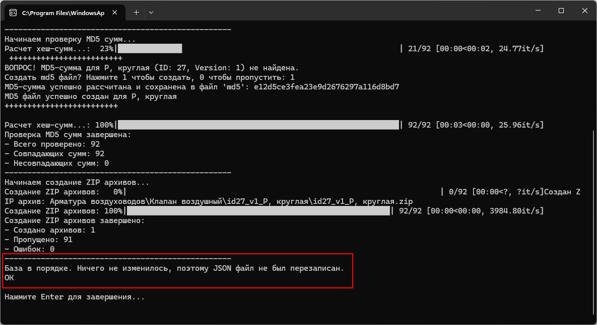

# Содержание

1. [Описание скриптов](#описание-скриптов)
   - [xlsxtojson.py](#xlsxtojsonpy)
   - [utils/consistency_checker.py](#utilsconsistency_checkerpy)
   - [utils/md5_checker.py](#utilsmd5_checkerpy)
   - [utils/hashcalc.py](#utilshashcalcpy)
   - [utils/zipper.py](#utilszipperpy)

# Что это

Этот readme предназначен для того, чтобы описать назначение и логику работы скрипта **xlsxtojson.py** с подскриптами.  **xlsxtojson.py** нужен, чтобы превратить человекочитаемый и человекозаполняемый xlsx-файл в читаемый браузером json-файл.

## Когда необходимо использование **xlsxtojson.py**
- при добавлении новых компонентов в библиотеку
- при удалении компонентов из библиотеки
- при измененении данных BIM-компонентов.

## В чем заключается использование **xlsxtojson.py**
- запускаешь двойным кликом из проводника Windows
- отвечаешь на вопрос о создании хеш-сумм в окне терминала (если скрипт задает этот вопрос. Он задается только в случае, если файл с именем `md5` отсутствует у компонента)
- читаешь отчет в окне терминала:
   - все ОК, файл был перезаписан. внизу надпись: ОК
   - все ОК, но файл не был перезаписан, потому что ничего не изменилось. внизу надпись: ОК
   - что-то не так. внизу надпись: ERROR.

## Что необходимо сделать для добавления новых компонентов в библиотеку

1. Добавить новую строчку в файл `/db/Base.xlsx` с данными компонента на листе *Компоненты*
2. Создать папку для компонента в `/components/{siteCategory}/{technicalCategory}/id{id}_v{version}_name/` и положить в нее папку BIM-компонента с именем `{name}` (в которой находится `*.repository`и другие файлы программы). Если нужно создать много папок, можно использовать скрипт `folders`, он создаст их сам по данным из `/db/Base.xlsx`.
3. Добавить изображение компонента в созданную папку. Чтобы оно было ровное, обрезайте его с помощью `cropwhite.py`
4. Добавить IFC-файл компонента в созданную папку.
5. Запустить `xlsxtojson.py`, ответить `1` на вопрос о создании хеш-суммы и увидеть в конце *ОК*.

Для удобства проведения рутинных операций также созданы другие скрипты, см. основной readme-файл.

Пример выполнения скрипта после выполнения шага 4:

Примеры ошибок при выполнении скрипта описаны ниже. При исполнении скрипт запускает другие скрипты в папке `pyscripts/xlsxtojson/utils`. Среди этих скриптов только `utils/hashcalc.py` может использоваться самостоятельно. 

Расположение папок и некоторые другие настройки производятся в файле `pyscripts/xlsxtojson/configuration/config.py`.

## **xlsxtojson.py**  
Скрипт предназначен для превращения человекочитаемого *xlsx*-формата в машиночитаемый *json*-файл. Он работает по следующим шагам:
1. Чтение данных из Excel файла, начиная с указанной ячейки и до указанного столбца.
2. Преобразование данных в формат JSON.
3. Запуск "проверок" с помощью файлов, перечисленных ниже.
3. Сохранение JSON данных в указанный файл при прохождении всех проверок и появлении информации о появлении новых/удалении старых/изменении существующих компонентов.

Пример успешной работы, когда JSON файл был перезаписан, выше. Пример успешной работы, когда изменений в файле не произошло, ниже:

## **utils/consistency_checker.py**  
Этот скрипт проверяет консистентность (цельность, интегрированность) базы данных компонентов. Он выполняет следующие проверки:
1. Наличие всех необходимых папок в структуре */components/*.
2. Наличие всех необходимых изображений.
3. Отсутствие неожиданных файлов или папок.

Пример отчета, когда не найдена нужная папка:

Пример отчета, когда найдена **не**нужная папка:

## **utils/md5_checker.py**  
Этот скрипт проверяет MD5 суммы файлов компонентов. Он выполняет следующие шаги:
1. Чтение MD5 суммы из JSON данных.
2. Вычисление MD5 суммы для каждого файла внутри папки с BIM-компонентом.
3. Сравнение вычисленной MD5 суммы с указанной в JSON и файле MD5.
4. Создание MD5 файла, если он отсутствует, по запросу пользователя, с помощью `hashcalc.py`.

Пример отчета, когда найдены отличия в *md5*-суммах:

Пример отчета, когда не найден *md5*-файл:

## **utils/hashcalc.py**  
Этот скрипт вычисляет MD5 суммы для файлов в указанной папке. Он выполняет следующие шаги:
1. Проверяет, что в папке, откуда он запускается, только одна папка, а файлов *md5* нет.
2. Вычисление MD5 суммы для каждого файла и сохранение файла *md5*.

Пример отчета, когда скрипт успешно отработал и создал *md5*-файл:  

**Отдельное использование hashcalc.py**  

Этот скрипт может быть использован отдельно: для этого нужно поместить его в папку с единственной подпапкой, для которой скрипт будет считать md5-сумму. 

Если файл с именем *md5* уже существует, скрипт не будет работать. Пример отчета:

Если подпапок больше одной или нет совсем, скрипт тоже не будет работать. Пример отчета:

## **utils/zipper.py**  
Этот скрипт создает ZIP архивы для каждого компонента. Он выполняет следующие шаги:
1. Чтение данных из JSON файла.
2. Создание ZIP архива для каждого компонента.
3. Пропуск создания архива, если он уже существует, или создание нового архива по запросу пользователя.

Пример отчета, когда zip-файл для компонента не был найден:
